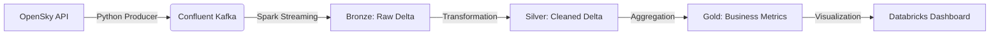
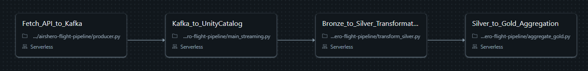
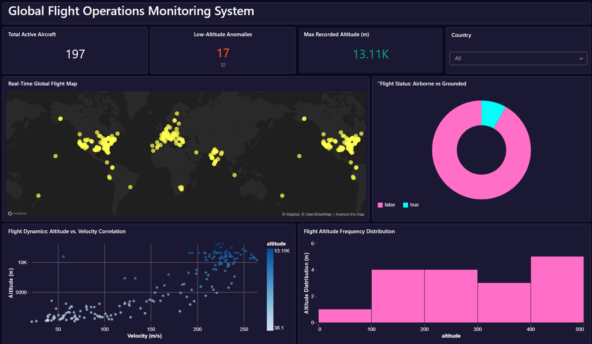

# AirShero: Real-Time Flight Data Pipeline ✈️🌍

This project implements a professional end-to-end data engineering pipeline using **Medallion Architecture**. It ingests live flight data from the OpenSky Network API, streams it through Kafka, and processes it within Databricks using Spark Structured Streaming and Batch processing.

---

## 🛠️ Tech Stack

| Component | Technology |
|---|---|
| **Languages** | Python (PySpark), SQL (DDL & Analytics) |
| **Data Transport** | Confluent Kafka Cloud (SASL/PLAIN) |
| **Processing Engine** | Apache Spark (Structured Streaming & Batch) |
| **Storage & Format** | Delta Lake on Unity Catalog (UC) |
| **Orchestration** | Databricks Workflows (4-stage Job) |
| **Infrastructure** | Databricks Serverless Compute |

---

## 🏗️ Architecture Overview

The pipeline follows the **Bronze → Silver → Gold** pattern to ensure data quality, reliability, and business-ready analytics. Each layer is physically stored as a Delta table within Databricks Unity Catalog.



---

## 📁 Project Structure

```
airshero/
├── config.py               # Centralized configuration for Kafka clusters, SASL auth, and env settings
├── schemas.py              # Strictly defined Spark StructType schemas for data validation and parsing
├── producer.py             # Python ingestion script for API polling and Kafka message production
├── main_streaming.py       # Kafka-to-Bronze streaming pipeline using incremental loading logic
├── transform_silver.py     # Silver Layer logic — data deduplication and refinement
└── aggregate_gold.py       # Gold Layer logic — business aggregations, statistics, and Z-Order optimization
```

---

## 🚀 Execution & Pipeline Orchestration

The project is fully automated using **Databricks Workflows**. The pipeline is designed to run incrementally, ensuring cost-efficiency while maintaining data freshness.

### Workflow Stages

| Stage | Notebook | Description |
|---|---|---|
| **1** | `Fetch_API_to_Kafka` | Polls OpenSky API and pushes raw state vectors to Kafka |
| **2** | `Kafka_to_Bronze_Streaming` | Consumes Kafka stream using `availableNow` trigger and saves to Bronze Delta table |
| **3** | `Bronze_to_Silver_Transformation` | Deduplicates data based on `icao24` (aircraft ID) and cleans malformed records |
| **4** | `Silver_to_Gold_Aggregation` | Calculates fleet metrics, safety alerts, and performs performance optimization |



---

## 💎 Medallion Layer Details

### 🟫 Bronze – `incoming_flights`
Acts as the **single source of truth**. Preserves the raw state of every API response for full audit trail and replayability. No transformations are applied at this layer.

### 🥈 Silver – `silver_flights`
A cleaned and deduplicated dataset. Records are deduplicated on `icao24` (aircraft ID), and malformed entries are filtered out. **Z-Order Optimization** is applied on `origin_country` to enable lightning-fast dashboard filtering.

### 🥇 Gold – `gold_fleet_statistics`
Highly aggregated tables designed for business users and dashboards.

- **KPIs:** Real-time tracking of total active aircraft and maximum recorded altitude.
- **Anomaly Detection:** Tracking of low-altitude flight patterns (below 500 m) for safety monitoring and alerting.

---

## 📊 Monitoring & Insights

The project concludes with an interactive **Databricks Dashboard** featuring:

- **Real-Time Flight Map** – Geographical distribution of active flights globally.
- **Altitude vs. Velocity Correlation** – Analysis of flight dynamics and cruising patterns.
- **Flight Status Distribution** – Visual breakdown of aircraft currently in the air versus on the ground.
- **Safety Thresholds** – Conditional formatting (🔴 Red / 🟢 Green) based on pre-defined safety limits.



---
*Built by [Roksolana Shendiukh](https://www.linkedin.com/in/roksolana-shendiukh-87a994226/)*
